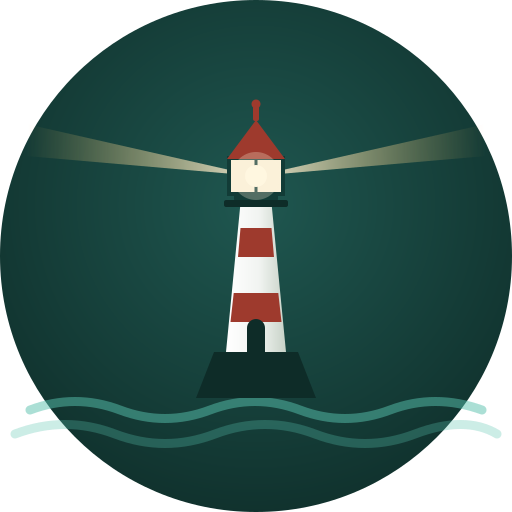

<p align="center">
  
</p>

# FAROL

**FAROL** - Framework Aberto de Rastreamento e Observância da LGPD.

Motor de detecção de dados pessoais e sensíveis (LGPD) em recursos publicados num portal
CKAN de dados abertos. Audita o que já foi publicado e pode bloquear o que ainda não foi -
sem nunca gravar o valor de PII encontrado, só metadados do achado (campo, categoria,
confiança, camada).

## Por que existe

Portais de dados abertos publicam recursos vindos de dezenas de sistemas e planilhas
diferentes, muitas vezes sem revisão de conteúdo campo a campo. Um CSV de "diárias de
servidores" ou um GeoJSON de "rede de atendimento" pode carregar CPF, endereço ou nome de
pessoa junto do dado que era, de fato, a intenção publicar. O FAROL audita isso -
sinalizando, não corrigindo sozinho - e pode recusar um upload antes de ele ser publicado.

Documentação completa, com passo a passo de instalação, guia de uso e referência de API: ver
`docs/` (site MkDocs, `docs/src/index.md`).

## Como funciona, em uma página

```
CKAN (produção ou terceiro) → scanner → pii-engine (/v1/scan) → farol-db (Postgres) → painéis
```

O `pii-engine` é o motor de verdade - um serviço HTTP único, sem estado, chamado tanto pelo
`scanner` (auditoria em lote de um catálogo já publicado) quanto pelo `ckanext-farol-guard`
(plugin CKAN que intercepta e pode recusar um upload antes de ele ser salvo). Internamente,
roda até três camadas de detecção, em ordem crescente de custo - cada uma só processa o que
a anterior não resolveu: heurística de nome de coluna + regex de valor (Camada 1), NER local
via Presidio/spaCy (Camada 2), e um classificador LLM local, Qwen3 via llama.cpp, que refina
a categoria exata do Art. 5º, II da LGPD (Camada 3). A Camada 3 nunca decide `bloquear`
sozinha - seu recall real ainda está abaixo da meta de projeto, então um achado só dela no
máximo vira `alertar` (fila de revisão humana).

## Componentes

| Componente | Papel | README |
|---|---|---|
| `pii-engine` | Motor de detecção (as três camadas), endpoint HTTP único | [`pii-engine/README.md`](pii-engine/README.md) |
| `scanner` | Auditoria em lote de um catálogo CKAN já publicado - serviço HTTP interno, disparado pela tela `/scan` do painel (sem CLI) | [`scanner/README.md`](scanner/README.md) |
| `painel` | Backend dos dois painéis (login por sessão, revisão de achado, API do gerencial) | [`painel/README.md`](painel/README.md) |
| `painel-gerencial` | Painel gerencial (React/Vite) - risco agregado, tendência, ranking por órgão | [`painel-gerencial/README.md`](painel-gerencial/README.md) |
| `ckanext-farol-guard` | Plugin CKAN preventivo - repositório separado, ver link abaixo | [`ckanext-farol-guard/README.md`](ckanext-farol-guard/README.md) |
| `docs/` | Site de documentação (MkDocs + Material) | `docs/src/index.md` |

`ckanext-farol-guard` fica fora deste repositório em produção (repositório próprio, preso às
dependências do CKAN) - a cópia em `ckanext-farol-guard/` aqui é a fonte versionada, sincronizada
manualmente para dentro da imagem do CKAN antes de cada build (ver o README do plugin).
`ckan-docker/` (clone oficial do projeto CKAN, usado só para o ambiente de teste local) também
fica fora deste repositório - nunca é nosso código.

## Como subir

Tudo containerizado - nada é instalado direto no host.

```bash
cp .env.example .env   # preencha com valores reais do seu ambiente
docker compose up -d pii-engine scanner painel painel-gerencial painel-nginx
```

Nenhum componente exige linha de comando pra uso normal. O `scanner` é um serviço permanente
(desde 2026-08-22) que só fica alcançável de dentro da rede do compose - disparar, cancelar e
acompanhar uma auditoria acontece pela tela `/scan` do painel técnico, com seleção de
organização e formato de arquivo, progresso em tempo real e modo incremental (reprocessa só
dataset novo ou alterado desde o último scan contra o mesmo CKAN). Ver `scanner/README.md`
para o contrato HTTP interno e `.env.example` para toda variável de ambiente disponível, com
comentário de propósito em cada bloco.

Acesso aos painéis (atrás de TLS, certificado autoassinado no ambiente de teste - troque por
um emitido de verdade num deploy em produção):

- Painel técnico: `https://<host>:8080/`
- Novo scan: `https://<host>:8080/scan`
- Painel gerencial: `https://<host>:8080/gerencial`

Login por sessão (formulário, cookie assinado) - não é HTTP Basic. Credencial definida em
`FAROL_TECNICO_USER`/`FAROL_TECNICO_PASSWORD` no `.env`; hoje é uma única credencial
compartilhada, não uma conta por pessoa (ver limitação em `painel/README.md`).

## Testes

Cada componente Python tem sua própria suíte, rodada dentro do container real (nunca no
host):

```bash
docker compose run --rm -v $(pwd)/pii-engine/tests:/app/tests --entrypoint sh pii-engine \
  -c "pip install --no-cache-dir -r requirements-test.txt -q && pytest -q tests"
```

Comando equivalente para `scanner` e `painel` (este último cria um banco Postgres
descartável, nunca toca no banco real) - ver a seção "Testes" de cada README. `painel-gerencial`
(React) ainda não tem suíte de teste própria.

## Segurança e privacidade

- Nenhuma camada de detecção grava ou loga o valor de PII encontrado - só metadados do
  achado.
- Download de recurso de terceiro verifica certificado TLS por padrão (`FAROL_VERIFY_TLS`),
  com exceção só por host explícito, nunca global.
- Login dos painéis por sessão de cookie assinado, atrás de TLS - nunca HTTP Basic.
- Relato de vulnerabilidade ou dúvida de segurança: abra uma issue neste repositório.

## Limitações conhecidas (transparência deliberada, não falta de revisão)

- Recall da Camada 3 medido contra dado real: 75% nas categorias sensíveis do Art. 5º, II
  (meta de projeto era 85%) - mitigado pelo teto de confiança, que impede bloqueio automático
  só com base nela.
- Credencial de login única e compartilhada nos dois painéis, não uma conta por pessoa.
- `painel-gerencial` não tem teste automatizado próprio ainda.

## Licença

MIT - ver [`LICENSE`](LICENSE). `ckanext-farol-guard` (repositório separado) tem sua própria
licença MIT, ver `ckanext-farol-guard/LICENSE`.
