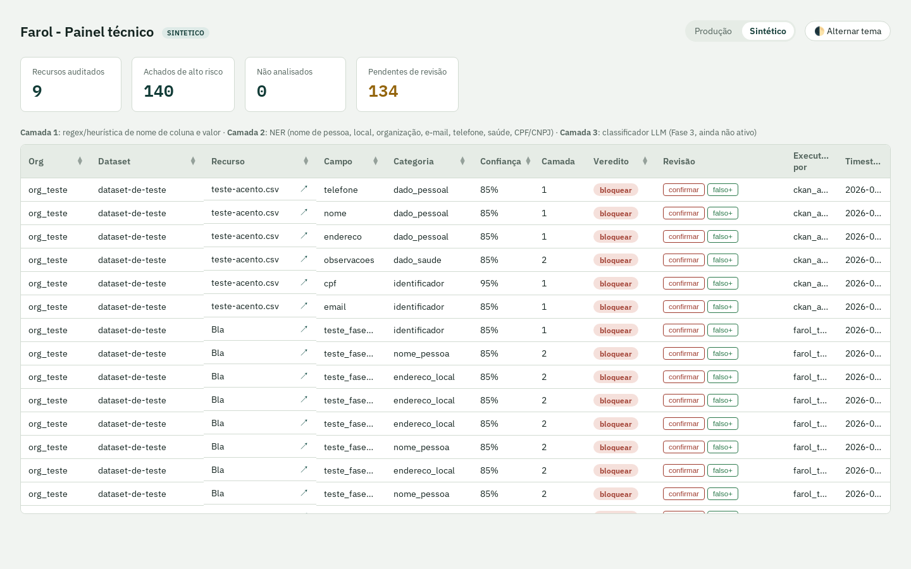

# Painel técnico

Responde "por que isso foi sinalizado?" - achado por campo, camada e confiança, nível recurso.
É a ferramenta de quem opera e revisa o motor, não um painel executivo (ver
[painel gerencial](painel-gerencial.md)).

!!! info "Captura de tela"
    A imagem abaixo é do ambiente **sintético** deste projeto (CSV de teste) - nunca uma
    captura contra dado real. Essa é uma regra dura do projeto: um achado real capturado em
    screenshot pode circular mais longe do que o próprio painel, e é difícil revogar depois de
    publicado. Se sua instalação precisa ilustrar um caso realista, monte um CSV sintético novo
    que produza esse achado.

## Login

Formulário próprio em `/login` (não é HTTP Basic) - credencial `FAROL_TECNICO_USER`/
`FAROL_TECNICO_PASSWORD` (ver [Variáveis de ambiente](../instalacao/variaveis-de-ambiente.md)),
sessão guardada num cookie assinado (`Secure`, `HttpOnly`, expira em 12h). `/logout` encerra a
sessão. O [painel gerencial](painel-gerencial.md) tem sessão e credencial próprias,
independentes desta - ver [Acesso e login](painel-gerencial.md#acesso-e-login) no guia do
painel gerencial.

## Cabeçalho e blocos de estatística

- **Abas Produção/Sintético** - cada achado é gravado com uma tag de ambiente; o painel só mostra
  um de cada vez, nunca mistura.
- **Recursos auditados**, **Achados de alto risco** (`veredito = bloquear`), **Não analisados**
  (`veredito = nao_analisado` - ver [glossário](../index.md#glossario)), **Pendentes de revisão**
  (achados `alertar`/`bloquear` ainda sem `revisao` humana registrada).
- **Alternar tema** - persiste a preferência clara/escuro (`prefers-color-scheme`, com opção
  de forçar manualmente).

## Disparar um novo scan

O link **Novo scan ↗** no cabeçalho leva à tela `/scan` - disparar, acompanhar (progresso em
tempo real, atualizado a cada 3s) e cancelar uma auditoria, com seleção de organização e
formato de arquivo, tudo pelo navegador, sem precisar de linha de comando. Desde 2026-08-22
essa é a única forma de rodar o scanner - ver o passo a passo completo em
[Rodar o scanner](../guia-do-administrador/rodar-o-scanner.md).

## A tabela

Cada linha é um achado, não um recurso - um recurso com 3 campos sinalizados gera 3 linhas.

- **Org / Dataset / Recurso** - de onde veio. A coluna Recurso tem um ícone ↗: link direto para o
  recurso original no portal configurado (`FAROL_PORTAL_PRODUCAO`/`FAROL_PORTAL_SINTETICO`) - é
  assim que o painel evita renderizar o valor de PII na própria tela (ver
  [Segurança e privacidade](../seguranca-e-privacidade.md)): quem revisa vê o dado no contexto de
  origem, não reproduzido aqui.
- **Campo / Categoria / Confiança / Camada** - o achado em si. `Camada` diz qual técnica gerou
  aquele achado específico (ver [arquitetura](../index.md#arquitetura-em-uma-pagina)).
- **Veredito** - chip colorido, mesmo vocabulário do [glossário](../index.md#glossario).
- **Colunas ordenáveis** (ícone ▲▼ duplo no cabeçalho) têm uma seta pra cada direção - clique em
  qualquer uma para reordenar por aquela coluna, sem perder a posição de rolagem da tabela.
- **Revisão** - dois botões, `confirmar` (verdadeiro positivo) e `falso+` (falso positivo). Ao
  clicar, a atualização acontece por `fetch()` sem recarregar a página inteira (só a linha
  clicada é substituída) - a posição de rolagem não se perde. O nome de quem revisou vem da
  própria credencial de login (não de um campo de texto livre), então não é possível autenticar
  como um usuário e registrar a revisão em nome de outro.

## Sobre a categoria `formato_nao_suportado`

Recursos com esse motivo de `nao_analisado` **não contam** como "achados de alto risco" nem
"pendentes de revisão" - contam só em "Não analisados", porque não representam nem um risco
confirmado nem uma ausência de risco: representam "não olhamos ainda".
